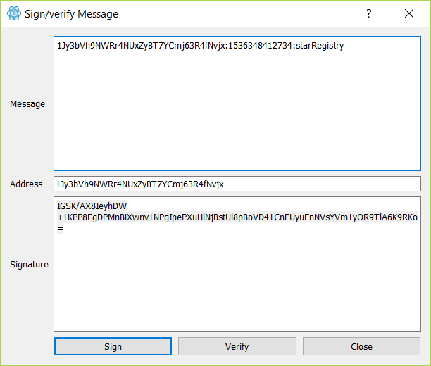

# Blockchain Data

Blockchain has the potential to change the way that the world approaches data. Develop Blockchain skills by understanding the data model behind Blockchain by developing your own simplified private blockchain.

# Star Coordinates

The star coordinates are similar to latitude and longitude but instead
relate to coordinates in the sky.

  <code><strong>RA</strong>  13h 03m 33.35s </code>
  <code><strong>DEC</strong> -49<sup>o</sup> 31' 38.1" </code>
  <code><strong>MAG</strong> 3.83 </code>
  <code><strong>Cen</strong></code>


|Abbreviation|Meaning                               |
|------------|--------------------------------------|
|**RA**      |Right Ascension                       |
|**DEC**     |Declination                           |
|**MAG**     |Magnitude (the brightness of the star)|
|**Cen**     |Centaurus                             |

## Celestial Coordinate System

In astronomy, a [celestial coordinate system][cel] (or celestial reference system) is a system for specifying positions of celestial objects: satellites, planets, stars, galaxies, and so on.

### Equatorial System

The equatorial coordinate system is centered at Earth's center, but fixed relative to the celestial poles and the vernal equinox. The equatorial system is the normal coordinate system for most professional and many amateur astronomers having an equatorial mount that follows the movement of the sky during the night.

* **Center Point (Origin)**: Center of the Earth (geocentric)
* **Fundamental Plane ($0^o$ latitude)**: Celestial equator
* **Poles**: Celestial poles
* **Coordinates**
  * **Latitude**: (**DEC**) Declination ($\delta$)
  * **Longitude**: (**RA**) Right Ascension ($\alpha$)
* **Primary Direction ($0^o$ longitude)**: Vernal equinox


## Apparent Magnitude

The [**apparent magnitude**][mag] (**m**) of a celestial object is a number that is a measure of its brightness as seen by an observer on Earth. The brighter an object appears, the lower its magnitude value (i.e. inverse relation). The Sun, at apparent magnitude of **−26.7**, is the brightest object in the sky. It is adjusted to the value it would have in the absence of the atmosphere. Furthermore, the magnitude scale is logarithmic. A difference of 1 in magnitude corresponds to a change in brightness by a factor of $\sqrt[5]{100}$, or about 2.512.

|Visibility  | Apparent Magnitude |
|------------|--------------------|
| Naked Eye  |      $\lt$ 6.5     |
| Binoculars |      $\leq$ 10     |

## Modern Constellations

In contemporary astronomy, the sky is divided into [88 regions][con] called constellations.

Each of the IAU constellations has an official 3 letter abbreviation.
The majority of the abbreviations are just the first three letters of the constellation, with the first character capitalised: *Ori* for *Orion*, *Ara* for *Ara*/*Arae*, *Com* for *Coma Berenices*.

## Resources for Discovering Stars

* [Google Sky][goo]
* [Skyview][sky]
* [Berkeley Coordinates][brk]
* [Skymap][skm]

## Getting Started

These instructions will get you a copy of the project up and running on your local machine for development and testing purposes.

### Prerequisites

Installing Node and NPM is pretty straightforward using the installer package available from the [Node.js® web site](https://nodejs.org/en/).

### Configuring your project

- Use NPM to initialize your project.
```
npm install
```
#### Frameworks

These are the main frameworks used in this project.

* `level`: A NodeJS-style *LevelDB* wrapper
* `hapi`: A framework for building applications and services
* `bitcoinjs-lib`: A javascript Bitcoin library for node.js and browsers.
* `bitcoinjs-message`: Utility library for signing/verifying messages using bitcoin wallet address and keys.

## Testing

To test code:

1) Open a command prompt or shell terminal after installing Node.js.

2) Run the web server with the command:
```
node index.js
```
3) Request a message to validate your wallet address to be used as the Blockchain Id for registering your star.
```
curl -X "POST" http://localhost:8000/requestValidation \
 -H "Content-Type:application/json; charset=utf-8" \
 -d "{\"address\":\"<your wallet address>\"}"

 {"address":"<your wallet address>",
  "requestTimestamp":1536441149,
  "validationWindow":1,
  "message":"1Jy3bVh9NWRr4NUxZyBT1YCmj63R2fNvjx:1536441149925:starRegistry"}
```
4) Use the 'Sign/Verify Message' utility of your Electrum wallet to sign the `message` and generate the *signature*.



5) Validate the Blockchain Id by POSTing the `address` and `signature` to the `/message-signature/validate` endpont.
```
curl -X "POST" "http://localhost:8000/message-signature/validate" \
 -H "Content-Type: application/json; charset=utf-8" \
 -d "{\"address\": \"1Jy3bVh9NWRr4NUxZyBT7YCmj63R4fNvjx\",\"signature\": \"IGSK/AX8IeyhDW+1KPP8EgDPMnBiXwnv1NPgIpePXuHlNjBstUl8pBoVD41CnEUyuFnNVsYVm1yOR9TlA6K9RKo=\"}"

 {"registerStar":true,
  "status":{"address":"1Jy3bVh9NWRr4NUxZyBT7YCmj63R4fNvjx",
            "requestTimestamp":1536443187,
            "message":"1Jy3bVh9NWRr4NUxZyBT7YCmj63R4fNvjx:1536443187889:starRegistry",
            "validationWindow":248,
            "messageSignature":"valid"}
  }
```

6) Register a star
```
curl -X "POST" http://localhost:8000/block -H "Content-Type: application/json; charset=utf-8"
 -d "{\"address\":\"1Jy3bVh9NWRr4NUxZyBT7YCmj63R4fNvjx\", \"star\":{
     \"dec\": \"-26° 29' 24.9\",
    \"ra\": \"16h 29m 1.0s\",
    \"story\": \"Found star using https://www.google.com/sky/\"
 }}"

{
  "hash":"10309daeedf02eebd447e9b53ef5c680f1a61e6b261df4091d78315596407131",
  "height":5,
  "body":{
    "address":"1Jy3bVh9NWRr4NUxZyBT7YCmj63R4fNvjx",
    "star":{
      "ra":"16h 29m 1.0s",
      "dec":"-26° 29' 24.9",
      "story":"466f756e642073746172207573696e672068747470733a2f2f7777772e676f6f676c652e636f6d2f736b792f"
    }
  },
  "time":"1536443353",
  "previousBlockHash":"0489943f8280d084541b217efc896d2a7f5b9663222eb3dd9dfe5b87ca01e122"
}
                  
```

7) Retrieve a block by its blockheight.
  http://localhost:8000/block/0

  Or, use another command prompt or shell terminal and run the `curl` tool
```
curl http://localhost:8000/block/0
```
8) Retrieve a block by its hash value.
  http://localhost:8000/stars/hash:a5b27ae6535ec79764b2fd021aa945fa710fa15653f8e3b8c327efc548e6a1d2
  
Or, using curl:
```
curl http://localhost:8000/stars/hash:a5b27ae6535ec79764b2fd021aa945fa710fa15653f8e3b8c327efc548e6a1d2

{
  "hash":"a5b27ae6535ec79764b2fd021aa945fa710fa15653f8e3b8c327efc548e6a1d2",
  "height":1,
  "body":{
    "address":"1F5VhMHukdnUES9kfXqzPzMeF1GPHKiF64",
    "star":{
      "ra":"ra",
      "dec":"dec",
      "story":"73746f7279"
    }
  },
  "time":"1536440215",
  "previousBlockHash":"5a4a57cd2942266b83d796d11944800f0cbff5554f32915e60f93da917205f88"
}
```
9) Retrieve a list of stars registered by a blockchain Id.
  http://localhost:8000/stars/address:1F5VhMHukdnUES9kfXqzPzMeF1GPHKiF64

Or, using curl:
```
curl http://localhost:8000/stars/address:1Jy3bVh9NWRr4NUxZyBT7YCmj63R4fNvjx

[
  {
    "hash":"69806b1dd3c2203aec24267b973438ea283aa8477d980f3efd09fc4fc27b65dc",
    "height":1,
    "body":
    {
      "address":"1Jy3bVh9NWRr4NUxZyBT7YCmj63R4fNvjx",
      "star":
      {
        "ra":"16h 29m 1.0s",
        "dec":"-26´┐¢ 29' 24.9",
        "story":"466f756e642073746172207573696e672068747470733a2f2f7777772e676f6f676c652e636f6d2f736b792f"
      }
    },
    "time":"1536538143",
    "previousBlockHash":"c652a9d0c51b3366cf04e06654ab0d7904f5b9eee837101ace064c9cd020a4b9"
  },
  {
    "hash":"e81350bacb132ccfe7d044b996cc9454e1b11bf88920c28bd21583cb2fd71789",
    "height":2,
    "body":
    {
      "address":"1Jy3bVh9NWRr4NUxZyBT7YCmj63R4fNvjx",
      "star":
      {
        "ra":"15h 17m 0.41382s",
        "dec":"-09´┐¢ 22' 58.4919","story":"466f756e642073746172207573696e6768747470733a2f2f656e2e77696b6970656469612e6f72672f77696b692f426574615f4c6962726165",
        "magnitude":"2.61",
        "constellation":"Lib"
      }
    },
    "time":"1536538151",
    "previousBlockHash":"69806b1dd3c2203aec24267b973438ea283aa8477d980f3efd09fc4fc27b65dc"
  },
  {
    "hash":"79bca0a044270f865da182d8a7c66d2c750d2e3da07359ca0e0f0f521509f5cb",
    "height":3,
    "body":
    {
      "address":"1Jy3bVh9NWRr4NUxZyBT7YCmj63R4fNvjx",
      "star":
      {
        "ra":"14h 50m 41.18097s",
        "dec":"-15´┐¢ 59' 50.0482","story":"466f756e642073746172207573696e6768747470733a2f2f656e2e77696b6970656469612e6f72672f77696b692f426574615f4c6962726165",
        "magnitude":"5.153",
        "constellation":"Lib"
      }
    },
    "time":"1536538163",
    "previousBlockHash":"e81350bacb132ccfe7d044b996cc9454e1b11bf88920c28bd21583cb2fd71789"
    }
  ]

```

## Endpoints documentation

> The endpoints documentation can also be viewed at [http://localhost:8000/docs](http://localhost:8000/docs).


### GET /block/{BLOCK_HEIGHT}

Gets a block using the `BLOCK_HEIGHT` as the path parameter. Returns a JSON formatted block content.

* URL: `/block/{BLOCK_HEIGHT}`
* method: `GET`
* response: JSON formatted block content.

#### Response example

```
curl http://localhost:8000/block/0
{
  "hash":"9695500836e92049f3fcc6f04fb13fda41ee9b42daa6a86347e26fc062dab51a",
  "height":0,
  "body":"First block in the chain - Genesis block",
  "time":"1535763291",
  "previousBlockHash":""
}

curl http://localhost:8000/block/1
{
  "hash":"69806b1dd3c2203aec24267b973438ea283aa8477d980f3efd09fc4fc27b65dc",
  "height":1,
  "body":
  {
    "address":"1Jy3bVh9NWRr4NUxZyBT7YCmj63R4fNvjx",
    "star":
    {
      "ra":"16h 29m 1.0s",
      "dec":"-26´┐¢ 29' 24.9",
      "story":"466f756e642073746172207573696e672068747470733a2f2f7777772e676f6f676c652e636f6d2f736b792f"
    }
  },
  "time":"1536538143",
  "previousBlockHash":"c652a9d0c51b3366cf04e06654ab0d7904f5b9eee837101ace064c9cd020a4b9"
}
```
#### Error response
A 404 response will be returned containing an error object if the blockchain does not contain a block with the given `BLOCK_HEIGHT`.

```
curl http://localhost:8000/block/1000
{"error":{"code":404,"message":"Key not found in database [1000]","info":[{"name":"blockHeight","value":1000}]}}
```

### POST /block

Creates and adds a new block in the blockchain with the star registry. Returns the block added.

* URL: `/block`
* method: `POST`
* request: JSON object
  * `address`: The Blockchain ID
  * `star`: The star object
    * `ra`: *Right Ascension* of the star.
    * `dec`: *Declination* of the star.
    * `story`: A description text with up to 250 words/500 bytes
    * `constellation`: (optional) Three letter constellation
    * `magnitude`: (optional) The apparent magnitude of the star
* response: JSON formatted block content.
* error responses:
  * error message: `Unknown address.`
    * HTTP status code: `400`
    * reason: The Blockchain ID was not previously validated by calling `/requestValidation` and `/message-signature/validate` endpoints.

#### Response example

```
curl -X "POST" http://localhost:8000/block
     -H "Content-Type: application/json; charset=utf-8"
     -d "{\"address\":\"1Jy3bVh9NWRr4NUxZyBT7YCmj63R4fNvjx\",
         \"star\":{
            \"dec\": \"-15° 59' 50.0482\",
            \"ra\": \"14h 50m 41.18097s\",
            \"constellation\":\"Lib\",
            \"magnitude\":\"5.153\",
            \"story\": \"Found star using https://en.wikipedia.org/wiki/Beta_Librae\"
          }
      }

{
  "hash":"79bca0a044270f865da182d8a7c66d2c750d2e3da07359ca0e0f0f521509f5cb",
  "height":3,
  "body":
  {
    "address":"1Jy3bVh9NWRr4NUxZyBT7YCmj63R4fNvjx",
    "star":
    {
      "ra":"14h 50m 41.18097s",
      "dec":"-15´┐¢ 59' 50.0482",
      "story":"466f756e642073746172207573696e6768747470733a2f2f656e2e77696b6970656469612e6f72672f77696b692f426574615f4c6962726165",
      "magnitude":"5.153",
      "constellation":"Lib"
    }
  },
  "time":"1536538163",
  "previousBlockHash":"e81350bacb132ccfe7d044b996cc9454e1b11bf88920c28bd21583cb2fd71789"
}
```
### POST /requestValidation

To be able to register a star, first it's necessary to send the Blockchain ID (wallet address) and sign a message returned by this endpoint.

* URL: `/requestValidation`
* method: `POST`
* response: JSON containing the message to be signed.

#### Response example

```
curl -X "POST" http://localhost:8000/requestValidation
 -H "Content-Type: application/json; charset=utf-8"
 -d "{\"address\":\"{A WALLET ADDRESS}\"}"

{
  "address":"{A WALLET ADDRESS}",
  "requestTimestamp":1536538079,
  "validationWindow":300,
  "message":"{A WALLET ADDRESS}:1536538079596:starRegistry"
}
```

### POST /message-signature/validate

After signing the message from `/requestValidation` the signature must be sent to this endpoint to validate the Blockchain ID. When validated, it will respond with a status object with `messageSignature` equals to `valid`. Once validated, the Blockchain ID can be used to register a single star.

* URL: `/message-signature/validate`
* method: `POST`
* response: JSON with the status object
* error responses:
  * error message: `Unknown address.`
    * HTTP status code: `400`
    * reason: The Blockchain ID was not used to request the validation message.
  * error message: `Validation window time out.`
    * HTTP status code: `400`
    * reason: The validation period expired.

#### Response example

```
curl -X "POST" http://localhost:8000/message-signature/validate
     -H "Content-Type:application/json; charset=urf-8"
     -d "{\"address\":\"1Jy3bVh9NWRr4NUxZyBT7YCmj63R4fNvjx\",
        \"signature\":\"IK92zEiel5Ka3RCuh0FOKcJGk3JA8Kx1Rsge0jkLmMudes5FzlLqmd0akRVKie2Km0z70CJdM8TNjRf2MvQTwWY=\"}"

{
  "registerStar":true,
  "status":
  {
    "address":"1Jy3bVh9NWRr4NUxZyBT7YCmj63R4fNvjx",
    "requestTimestamp":1536538079,
    "message":"1Jy3bVh9NWRr4NUxZyBT7YCmj63R4fNvjx:1536538079596:starRegistry",
    "validationWindow":254,
    "messageSignature":"valid"
  }
}
```
#### Error response example

```
curl -X "POST" http://localhost:8000/message-signature/validate
     -H "Content-Type:application/json; charset=urf-8" 
     -d "{\"address\":\"1Jy3bVh9NWRr4NUxZyBT7YCmj63R4fNvjx\",
        \"signature\":\"IK92zEiel5Ka3RCuh0FOKcJGk3JA8Kx1Rsge0jkLmMudes5FzlLqmd0akRVKie2Km0z70CJdM8TNjRf2MvQTwWY=\"}"

{
  "error":
  {
    "code":400,
    "message":"Validation window time out.",
    "address":"1Jy3bVh9NWRr4NUxZyBT7YCmj63R4fNvjx"
  }
}
```
### GET /stars/hash:{HASH}
Retrieve a block in the blockchain by its hash code.

* URL: `/stars/hash:{HASH}`
* method: `GET`
* response: The block with the hash code.
* error message: `Block not found.`
  * HTTP status code: `404`
  * reason: No block in the blockchain with the hash was found.

#### Response example

```
curl http://localhost:8000/stars/hash:69806b1dd3c2203aec24267b973438ea283aa8477d980f3efd09fc4fc27b65dc
{
  "hash":"69806b1dd3c2203aec24267b973438ea283aa8477d980f3efd09fc4fc27b65dc",
  "height":1,
  "body":
  {
    "address":"1Jy3bVh9NWRr4NUxZyBT7YCmj63R4fNvjx",
    "star":
    {
      "ra":"16h 29m 1.0s",
      "dec":"-26´┐¢ 29' 24.9",
      "story":"466f756e642073746172207573696e672068747470733a2f2f7777772e676f6f676c652e636f6d2f736b792f"
    }
  },
  "time":"1536538143",
  "previousBlockHash":"c652a9d0c51b3366cf04e06654ab0d7904f5b9eee837101ace064c9cd020a4b9"
}
```
#### Error response example

```
curl http://localhost:8000/start/hash:abcd
{"error":{"code":404,"message":"Block not found.","info":[{"name":"hash","value":"abcd"}]}}
```

### GET /stars/address:{ADDRESS}
Retrieve a list os blocks registered by the Blockchain ID.

* URL: `/stars/address:{ADDRESS}`
* method: `GET`
* response: list of blocks.

#### Response example

```
curl http://localhost:8000/stars/address:1Jy3bVh9NWRr4NUxZyBT7YCmj63R4fNvjx

[
  {
    "hash":"69806b1dd3c2203aec24267b973438ea283aa8477d980f3efd09fc4fc27b65dc",
    "height":1,
    "body":
    {
      "address":"1Jy3bVh9NWRr4NUxZyBT7YCmj63R4fNvjx",
      "star":
     {
        "ra":"16h 29m 1.0s",
        "dec":"-26´┐¢ 29' 24.9",
        "story":"466f756e642073746172207573696e672068747470733a2f2f7777772e676f6f676c652e636f6d2f736b792f"
      }
    },
    "time":"1536538143",
    "previousBlockHash":"c652a9d0c51b3366cf04e06654ab0d7904f5b9eee837101ace064c9cd020a4b9"
  },
  {
    "hash":"e81350bacb132ccfe7d044b996cc9454e1b11bf88920c28bd21583cb2fd71789",
    "height":2,
    "body":
    {
      "address":"1Jy3bVh9NWRr4NUxZyBT7YCmj63R4fNvjx",
      "star":
      {
        "ra":"15h 17m 0.41382s",
        "dec":"-09´┐¢ 22' 58.4919",
        "story":"466f756e642073746172207573696e6768747470733a2f2f656e2e77696b6970656469612e6f72672f77696b692f426574615f4c6962726165",
        "magnitude":"2.61",
        "constellation":"Lib"
      }
    },
    "time":"1536538151",
    "previousBlockHash":"69806b1dd3c2203aec24267b973438ea283aa8477d980f3efd09fc4fc27b65dc"
  },
  {
    "hash":"79bca0a044270f865da182d8a7c66d2c750d2e3da07359ca0e0f0f521509f5cb",
    "height":3,
    "body":
    {
      "address":"1Jy3bVh9NWRr4NUxZyBT7YCmj63R4fNvjx",
      "star":
      {
        "ra":"14h 50m 41.18097s",
        "dec":"-15´┐¢ 59' 50.0482",
        "story":"466f756e642073746172207573696e6768747470733a2f2f656e2e77696b6970656469612e6f72672f77696b692f426574615f4c6962726165",
        "magnitude":"5.153",
        "constellation":"Lib"
      }
    },
    "time":"1536538163",
    "previousBlockHash":"e81350bacb132ccfe7d044b996cc9454e1b11bf88920c28bd21583cb2fd71789"
  }
]
```


----
[cel]: https://en.wikipedia.org/w/index.php?title=Celestial_coordinate_system&oldid=855672603 "Celestial Coordinate System"
[mag]: https://en.wikipedia.org/w/index.php?title=Apparent_magnitude&oldid=857838597 "Apparent magnitude"
[con]: https://en.wikipedia.org/w/index.php?title=88_modern_constellations&oldid=852796507 "88 modern constellations"
[goo]: https://www.google.com/sky/ "Google Sky"
[sky]: https://skyview.gsfc.nasa.gov/blog/index.php/2012/12/04/can-you-help-me-find-a-star/ "Skyview"
[brk]: http://cse.ssl.berkeley.edu/SegwayEd/lessons/findplanets/coordinates.html "Berkeley Coordinates"
[skm]: https://in-the-sky.org/skymap.php "Skymap"